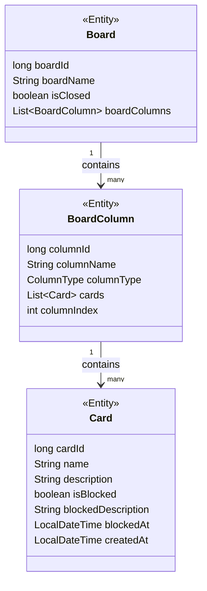

# Gerenciador de tarefas
Gerenciado de tarefas estilo Kanban.

---

### **Principais Funcionalidades**
1. **Gerenciamento de Quadros (Boards)**:
    - Criar, buscar e listar quadros.
    - As entidades `Board` possuem um conjunto de colunas (`BoardColumns`), representando etapas de um processo.

2. **Gerenciamento de Colunas (Columns)**:
    - As colunas têm atributos como tipo (`ColumnType`) e índice (`columnIndex`), com suporte para ordenação.
    - Integram diretamente os quadros e podem conter cartões (`Card`).

3. **Gerenciamento de Cartões (Cards)**:
    - Cartões podem ser adicionados a colunas específicas e possuem atributos como nome, descrição, status de bloqueio (`isBlocked`), e datas relacionadas.
    - Um cartão nas colunas FINAL, CANCELED ou com status bloqueado não pode ser movido.

4. **Ordenação e Lógica de Negócio**:
    - Ordenação natural implementada para `BoardColumn` com base no `ColumnType` e `columnIndex`, implementando `Comparable`.

5. **Persistência de Dados com JPA/Hibernate**:
    - As relações entre `Board`, `BoardColumn` e `Card` são mapeadas utilizando JPA.

---

### **Tecnologias Utilizadas**
- **Spring Framework**: `Component` e `Service` utilizados para injeção dedependências e `JpaRepository` para a pesistência e acesso de dados, `CommandRunnerLine` para iniciar a aplicação.
- **JPA/Hibernate**: Mapeamento objeto-relacional e gerência do ciclo de vida das entidades.
- **Lombok**: Redução de código boilerplate.
- **SLF4J**: Logs centralizados.

---

### Diagram
classDiagram
class Board {
<<Entity>>
long boardId
String boardName
boolean isClosed
List~BoardColumn~ boardColumns
}

